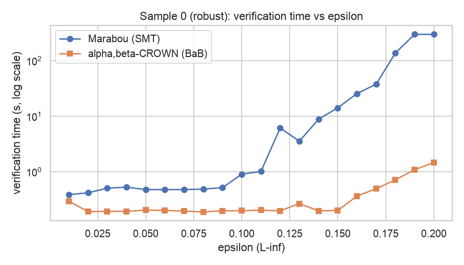
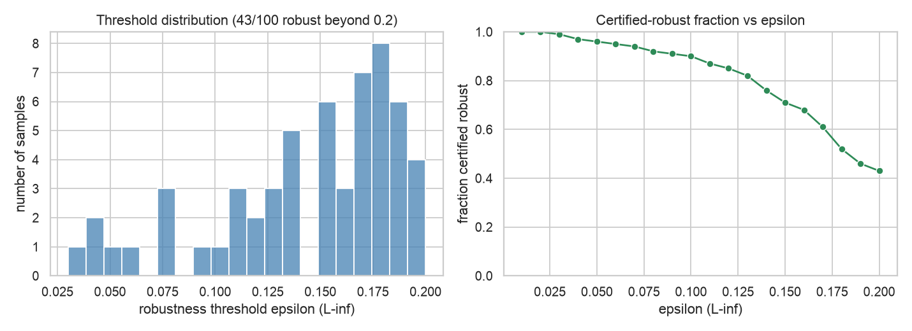
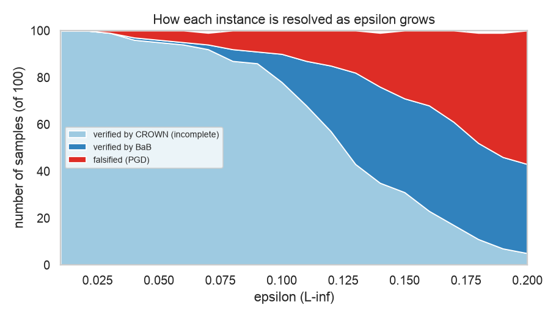
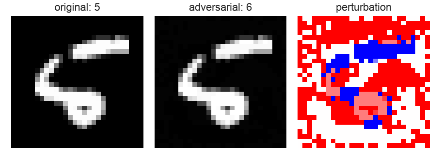

<div align="center">

# 🛡️ α,β-CROWN Robustness Verification

### Formally verifying the ℓ∞ robustness of a neural network with bound propagation — and benchmarking it against an SMT solver.

[](https://www.python.org/)
[](https://pytorch.org/)
[](https://onnx.ai/)
[](https://github.com/Verified-Intelligence/alpha-beta-CROWN)
[](LICENSE)

<sub>Linear relaxation · Branch-and-bound · Complete verification · MNIST</sub>

</div>

---

## ✨ Overview

How do you *prove* that a neural network can't be fooled by a small perturbation?
This project takes a small MNIST classifier and formally verifies its **local ℓ∞
robustness** using [**α,β-CROWN**](https://github.com/Verified-Intelligence/alpha-beta-CROWN)
— the multi-time winner of the [VNN-COMP](https://sites.google.com/view/vnn2024)
neural-network verification competition — then puts the results head-to-head against
the SMT-based verifier [**Marabou**](https://github.com/NeuralNetworkVerification/Marabou).

> Two verifiers, one model, the same property — and a clear look at *why* bound
> propagation scales where SMT struggles.

## 🔍 Why this is interesting

- **Verification ≠ accuracy.** A network can be 98% accurate and still have inputs
  whose label flips under an imperceptible perturbation. Verification *proves* whether
  a robustness property holds for **every** point in an ε-ball — not just the test set.
- **Two philosophies, compared.** α,β-CROWN relaxes the network into linear bounds and
  closes the gap with branch-and-bound; Marabou encodes the network as an SMT query.
  Same question, very different engines.
- **Reproducible by design.** Pinned environment, a one-command `test.py`, and YAML
  configs you can re-run.

## 🧠 How it works

```
            input x  +  ε-ball (ℓ∞)
                     │
        ┌────────────┴─────────────┐
        │   α,β-CROWN              │   ← linear relaxation of ReLUs
        │   bound propagation     │     + α/β optimization
        │   + branch-and-bound    │     + BaB on unstable neurons
        └────────────┬─────────────┘
                     │
     ┌───────────────┼────────────────┐
  VERIFIED        FALSIFIED         TIMEOUT
 (robust ∀x)   (counterexample)   (undecided)
```

## 🚀 Getting Started

### Prerequisites
- Python 3.11 (Conda recommended)
- A clone of [α,β-CROWN](https://github.com/Verified-Intelligence/alpha-beta-CROWN)
  *(installed separately — not vendored in this repo)*

> Tested on macOS (Apple Silicon, arm64), Python 3.11, CPU-only.

```bash
# 1. Clone this project + the verifier (with its auto_LiRPA submodule)
git clone https://github.com/ashmin100/abcrown-bound-propagation-nn-verification.git
cd abcrown-bound-propagation-nn-verification
git clone --recursive https://github.com/Verified-Intelligence/alpha-beta-CROWN.git

# 2. Create the environment and install dependencies
conda create -n abcrown python=3.11
conda activate abcrown
pip install -r requirements.txt
pip install -e alpha-beta-CROWN/auto_LiRPA      # editable install of auto_LiRPA

# 3. Sanity check (CPU)
python alpha-beta-CROWN/complete_verifier/abcrown.py \
  --config alpha-beta-CROWN/complete_verifier/exp_configs/tutorial_examples/mnist_cnn_a_adv.yaml \
  --device cpu --end 2 --timeout 30
```

> **Notes (macOS / Apple Silicon):**
> - No CUDA → always pass `--device cpu`.
> - `gurobipy` is imported by α,β-CROWN but unused here (BaB-only); no license needed.
> - If `conda` errors with a libmamba/`libarchive` message, add `--solver classic`.

### Quickstart
```bash
python gen_vnnlib.py        # generate VNNLIB robustness specs
python test.py              # smoke test: verify two samples (one robust, one not)
python run_experiments.py   # full study: 100-sample scan + ε sweep -> results/
python analyze.py           # deep analyses + figures -> results/
```

## ⚙️ Configuration

Runs are driven by YAML, the native α,β-CROWN format. This project verifies an ONNX model
against per-instance VNNLIB specs in batch mode (one spec per line of `instances.csv`):

```yaml
general:
  device: cpu                 # no CUDA: run on CPU
  csv_name: instances.csv     # one VNNLIB spec per line (batch mode)
model:
  onnx_path: models/mnist_fc.onnx
  input_shape: [-1, 784]
specification:
  vnnlib_path: null           # null => use csv_name
bab:
  timeout: 60                 # seconds per instance
  branching:
    method: kfsb              # branching heuristic
```

The VNNLIB specs encode an ℓ∞ ball `x_i ± ε` (clipped to the valid input range) and the
property "the true class stays the arg-max"; they are produced by `gen_vnnlib.py`.

## 📊 Results

The model is a fully-connected MNIST classifier (`784→64→32→10`, ReLU). Two phases mirror
an earlier Marabou study so the verifiers can be compared on identical instances.

**Phase 1 — sample scan** (100 samples, ε=0.05): 96 verified robust, 4 falsified
(samples 8, 33, 92, 96); mean 0.21 s per instance.

**Phase 2 — robustness thresholds** (smallest ε with a counterexample):

| sample | threshold ε |
|:---:|:---:|
| 0 | robust through 0.20 |
| 8 | 0.03 |
| 33 | 0.05 |

### Verification time vs. ε
On a robust sample, α,β-CROWN stays near-constant while the SMT solver grows steeply and
hits its 300 s timeout for ε ≥ 0.19 — up to ~270× faster over the tested range.



### Robustness radius over the test set
Certifying all 100 samples is inexpensive here: 43/100 stay robust beyond ε=0.20.



### How instances are resolved
As ε grows, fewer instances are settled by the cheap CROWN bound; more need
branch-and-bound, and more are falsified by the PGD attack.



### Counterexamples
For a falsified sample, the verifier returns an adversarial input inside the ε-ball
(original | adversarial | perturbation):



## ⚔️ α,β-CROWN vs. Marabou

| | α,β-CROWN | Marabou |
|---|---|---|
| Approach | Linear relaxation + branch-and-bound | SMT (Reluplex) |
| Interface | Declarative YAML config | Python API |
| Model input | ONNX or PyTorch | ONNX / NNet |
| Property spec | VNNLIB or dataset + ε | per-variable bounds in code |
| Verdicts on shared instances | identical to Marabou | identical to α,β-CROWN |
| Robust sample at ε=0.20 | ~1.5 s | 300 s (timeout) |
| Single small query (cold start) | ~2.5 s | ~0.5 s |

Where both tools ran, their verdicts agree; α,β-CROWN scales far better at large ε, while
Marabou has lower start-up cost for a single small query.

## 🗂️ Project Structure

```
gen_vnnlib.py          generate VNNLIB robustness specs
abcrown_runner.py      batch-run α,β-CROWN and parse verdicts
test.py                minimal demo (two samples)
run_experiments.py     two-phase study (sample scan + ε sweep)
analyze.py             deep analyses + figures
mnist_fc.yaml          verification config
models/                ONNX model + sample inputs
results/               tables, CSVs, and figures
exploration_report.pdf α,β-CROWN models / config survey
report.pdf             analysis report (EN); report_ko.pdf (KO)
```

## 📚 References

- Wang et al., *Beta-CROWN: Efficient Bound Propagation with Per-neuron Split Constraints
  for Neural Network Robustness Verification*, NeurIPS 2021.
- Xu et al., *Fast and Complete: Enabling Complete Neural Network Verification...*, ICLR 2021.
- Katz et al., *The Marabou Framework for Verification and Analysis of DNNs*, CAV 2019.

## 📄 License

Released under the [MIT License](LICENSE).

---

<div align="center">
<sub>🇰🇷 한국어 설명은 <a href="README_ko.md">README_ko.md</a> 참고.</sub>
</div>
